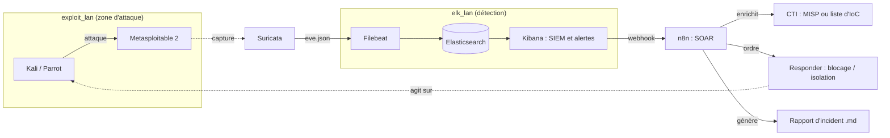

# SOC Run : plan de mise en place en solo, pas à pas

> Objectif : construire seul un mini-SOC conteneurisé (attaque → détection → alerte → orchestration → remédiation → rapport d'incident) et le versionner proprement sur Git.
>
> Vous jouez les deux rôles (Red et Blue). Ce n'est pas un problème technique, mais **le sujet prévoit des équipes de 5** : vérifiez auprès de l'enseignant que le travail en solo est accepté et comment la notation est adaptée.

Les blocs de code sont des **points de départ à adapter** à vos versions d'images. Cochez les cases au fil de l'eau : GitHub/GitLab affichent l'avancement.

---

## Vue d'ensemble

| Phase | Contenu                                     | Temps estimé                                                      |
| ----- | ------------------------------------------- | ----------------------------------------------------------------- |
| 0     | Prérequis, dépôt Git                        | 2 h                                                               |
| 1     | Réseaux, volumes, `.env`                    | 1 h                                                               |
| 2     | Stack ELK sécurisée                         | 3 h                                                               |
| 3     | Suricata + Filebeat                         | 4 h                                                               |
| 4     | Lab offensif (Kali/Parrot + Metasploitable) | 2 h                                                               |
| 5     | Dashboards et règle d'alerte Kibana         | 4 h                                                               |
| 6     | SOAR (n8n) + CTI + rapport auto             | 6 h                                                               |
| 7     | Remédiation active (service « responder »)  | 5 h                                                               |
| 8     | Test bout en bout et mesures                | 3 h                                                               |
| 9     | Rapport d'incident                          | 4 h                                                               |
| 10    | Finitions Git/CI et soutenance              | 4 h                                                               |
|       | **Total**                                   | **≈ 38 h (5 à 6 jours pleins ou 2 à 3 semaines à temps partiel)** |

## Architecture cible



## Décisions à prendre dès le départ (solo)

| Sujet | Recommandation | Pourquoi |
|---|---|---|
| Hôte | **Linux natif ou VM Linux** | Sous Docker Desktop (Windows/macOS), Docker tourne dans une VM : Suricata en `network_mode: host` ne verrait pas les ponts Docker. |
| RAM | 8 Go = juste, 16 Go = confortable | ELK + Suricata + n8n + 2 machines de lab ≈ 5 à 6 Go. |
| SOAR | **n8n** | 1 conteneur, rapide à prendre en main. Shuffle ajoute frontend, backend, Orborus et OpenSearch (lourd seul). |
| CTI | Commencer par un **mini-CTI** (fichier/API d'IoC interrogé par n8n), passer à **MISP** si vous avez ≥ 16 Go | MISP est lourd (base de données, Redis, workers). Le sujet cite MISP/OpenCTI : justifiez votre choix en soutenance. |
| Traefik | Optionnel au début : publiez les ports sur `127.0.0.1` | Ajoutez Traefik à la phase 10 si le temps le permet. |

---

## Phase 0 : Prérequis et dépôt Git (≈ 2 h)

- [ ] Installer Docker Engine et le plugin Compose ; vérifier `docker compose version`.
- [ ] Vérifier la RAM : `free -h`.
- [ ] Régler Elasticsearch de façon persistante (sinon il crashe au démarrage) :
  ```bash
  echo "vm.max_map_count=262144" | sudo tee /etc/sysctl.d/99-elastic.conf
  sudo sysctl --system
  ```
- [ ] Créer le dépôt et l'arborescence :
  ```bash
  mkdir soc-run && cd soc-run && git init -b main
  mkdir -p suricata/rules filebeat kibana soar playbooks responder report/generated scripts docs
  touch docs/journal.md
  ```
  ```
  soc-run/
  ├── docker-compose-elk.yml
  ├── docker-compose-exploit.yml
  ├── docker-compose-n8n.yml
  ├── .env.example          # versionné, sans secrets
  ├── .gitignore            # contient .env
  ├── Makefile
  ├── suricata/  (suricata.yaml, rules/local.rules)
  ├── filebeat/  (filebeat.yml)
  ├── kibana/    (exports dashboards/règles .ndjson)
  ├── soar/      (workflows n8n exportés .json)
  ├── playbooks/ (remédiation R0→R3, .md)
  ├── responder/ (service d'actions défensives)
  ├── report/    (template + rapports, generated/)
  ├── scripts/   (tests de la chaîne)
  └── docs/      (journal.md, schéma, captures)
  ```
- [ ] Créer le `.gitignore` **avant** le premier commit :
  ```gitignore
  .env
  *.pem
  *.key
  report/generated/*
  !report/generated/.gitkeep
  ```
- [ ] Écrire dans `docs/journal.md` : date, objectif, décisions (tableau ci-dessus).
- [ ] Premier commit :
  ```bash
  git add . && git commit -m "chore: init repo structure"
  ```
- [ ] Créer le dépôt distant (privé pendant le développement) puis `git remote add origin <url> && git push -u origin main`.

**Conventions Git conseillées** : un commit par étape cochée, messages du type `feat(elk): add setup service`, un **tag par phase validée** (`git tag phase-2-ok`). Le jury apprécie la traçabilité.

**Validation phase 0 :** `git status` propre, `.env` ignoré, `docker compose version` OK.

---

## Phase 1 : Réseaux, volumes et `.env` (≈ 1 h)

- [ ] Créer les réseaux. Astuce : donnez un **nom de pont fixe** et un sous-réseau fixe à `exploit_lan`, cela évite de chercher le `br-xxxxxxxx` pour Suricata.
  ```bash
  docker network create elk_lan
  docker network create worker_lan
  docker network create traefik_lan
  docker network create --driver bridge --subnet 172.30.0.0/24 \
    -o "com.docker.network.bridge.name=br-exploit" exploit_lan
  ```
- [ ] Créer le volume partagé des logs Suricata (utilisé par deux fichiers compose) :
  ```bash
  docker volume create suricatadata01
  ```
- [ ] Créer `.env.example` (versionné) puis `cp .env.example .env` :
  ```dotenv
  STACK_VERSION=8.15.3          # choisir une version 8.x récente et la figer
  ELASTIC_PASSWORD=changeme
  KIBANA_PASSWORD=changeme
  ENCRYPTION_KEY=changeme       # openssl rand -hex 32
  ES_MEM_LIMIT=2147483648
  KB_MEM_LIMIT=1073741824
  LICENSE=basic                 # trial si un connecteur d'alerte l'exige (30 jours)
  ```
- [ ] Générer de vrais secrets dans `.env` : `openssl rand -hex 16` pour les mots de passe, `openssl rand -hex 32` pour `ENCRYPTION_KEY`.
- [ ] Vérifier : `git check-ignore -v .env` doit répondre.
- [ ] Commit : `feat(infra): networks, volume, env template`.

**Validation phase 1 :** `docker network ls` montre les 4 réseaux, `ip a show br-exploit` existe, aucun secret dans `git log -p`.

---

## Phase 2 : Stack ELK sécurisée (≈ 3 h)

Base : l'exemple officiel Elastic « docker compose » (CA + certificats TLS générés par un service `setup`), réduit à **un seul nœud**. Comparez avec la documentation de votre version.

- [ ] Écrire `docker-compose-elk.yml` :
  ```yaml
  name: soc-elk
  services:
    setup:
      image: docker.elastic.co/elasticsearch/elasticsearch:${STACK_VERSION}
      user: "0"
      volumes: [certs:/usr/share/elasticsearch/config/certs]
      networks: [elk_lan]
      command: >
        bash -c '
          [ -z "${ELASTIC_PASSWORD}" ] && { echo "ELASTIC_PASSWORD manquant"; exit 1; };
          [ -z "${KIBANA_PASSWORD}" ] && { echo "KIBANA_PASSWORD manquant"; exit 1; };
          if [ ! -f config/certs/ca.zip ]; then
            bin/elasticsearch-certutil ca --silent --pem -out config/certs/ca.zip;
            unzip config/certs/ca.zip -d config/certs;
          fi;
          if [ ! -f config/certs/certs.zip ]; then
            printf "instances:\n  - name: es01\n    dns: [es01, localhost]\n    ip: [127.0.0.1]\n  - name: kibana\n    dns: [kibana, localhost]\n    ip: [127.0.0.1]\n" > config/certs/instances.yml;
            bin/elasticsearch-certutil cert --silent --pem -out config/certs/certs.zip \
              --in config/certs/instances.yml --ca-cert config/certs/ca/ca.crt --ca-key config/certs/ca/ca.key;
            unzip config/certs/certs.zip -d config/certs;
          fi;
          chown -R root:root config/certs; find config/certs -type d -exec chmod 750 {} \;; find config/certs -type f -exec chmod 640 {} \;;
          until curl -s --cacert config/certs/ca/ca.crt https://es01:9200 | grep -q "missing authentication credentials"; do sleep 5; done;
          until curl -s -X POST --cacert config/certs/ca/ca.crt -u "elastic:${ELASTIC_PASSWORD}" \
            -H "Content-Type: application/json" https://es01:9200/_security/user/kibana_system/_password \
            -d "{\"password\":\"${KIBANA_PASSWORD}\"}" | grep -q "^{}"; do sleep 5; done;
          echo "All done!";
        '
      healthcheck:
        test: ["CMD-SHELL", "[ -f config/certs/es01/es01.crt ]"]
        interval: 1s
        timeout: 5s
        retries: 120

    es01:
      depends_on: { setup: { condition: service_healthy } }
      image: docker.elastic.co/elasticsearch/elasticsearch:${STACK_VERSION}
      volumes: [certs:/usr/share/elasticsearch/config/certs, esdata01:/usr/share/elasticsearch/data]
      ports: ["127.0.0.1:9200:9200"]
      networks: [elk_lan]
      environment:
        - node.name=es01
        - cluster.name=soc-run
        - discovery.type=single-node
        - ELASTIC_PASSWORD=${ELASTIC_PASSWORD}
        - bootstrap.memory_lock=true
        - xpack.security.enabled=true
        - xpack.security.http.ssl.enabled=true
        - xpack.security.http.ssl.key=certs/es01/es01.key
        - xpack.security.http.ssl.certificate=certs/es01/es01.crt
        - xpack.security.http.ssl.certificate_authorities=certs/ca/ca.crt
        - xpack.security.transport.ssl.enabled=true
        - xpack.security.transport.ssl.key=certs/es01/es01.key
        - xpack.security.transport.ssl.certificate=certs/es01/es01.crt
        - xpack.security.transport.ssl.certificate_authorities=certs/ca/ca.crt
        - xpack.security.transport.ssl.verification_mode=certificate
        - xpack.license.self_generated.type=${LICENSE}
      mem_limit: ${ES_MEM_LIMIT}
      ulimits: { memlock: { soft: -1, hard: -1 } }
      healthcheck:
        test: ["CMD-SHELL", "curl -s --cacert config/certs/ca/ca.crt https://localhost:9200 | grep -q 'missing authentication credentials'"]
        interval: 10s
        timeout: 10s
        retries: 120

    kibana:
      depends_on: { es01: { condition: service_healthy } }
      image: docker.elastic.co/kibana/kibana:${STACK_VERSION}
      volumes: [certs:/usr/share/kibana/config/certs, kibanadata:/usr/share/kibana/data]
      ports: ["127.0.0.1:5601:5601"]
      networks: [elk_lan]   # ajouter traefik_lan plus tard
      environment:
        - SERVERNAME=kibana
        - ELASTICSEARCH_HOSTS=https://es01:9200
        - ELASTICSEARCH_USERNAME=kibana_system
        - ELASTICSEARCH_PASSWORD=${KIBANA_PASSWORD}
        - ELASTICSEARCH_SSL_CERTIFICATEAUTHORITIES=config/certs/ca/ca.crt
        - XPACK_SECURITY_ENCRYPTIONKEY=${ENCRYPTION_KEY}
        - XPACK_ENCRYPTEDSAVEDOBJECTS_ENCRYPTIONKEY=${ENCRYPTION_KEY}
        - XPACK_REPORTING_ENCRYPTIONKEY=${ENCRYPTION_KEY}
      mem_limit: ${KB_MEM_LIMIT}

  networks:
    elk_lan: { external: true }
  volumes:
    certs:
    esdata01:
    kibanadata:
  ```
  *La clé `xpack.encryptedSavedObjects.encryptionKey` est indispensable pour créer des règles d'alerte dans Kibana.*
- [ ] Lancer : `docker compose -f docker-compose-elk.yml up -d` puis `docker compose -f docker-compose-elk.yml logs -f setup` jusqu'à « All done! ».
- [ ] Tester Elasticsearch :
  ```bash
  docker compose -f docker-compose-elk.yml cp setup:/usr/share/elasticsearch/config/certs/ca/ca.crt ./ca.crt
  curl --cacert ./ca.crt -u elastic:$ELASTIC_PASSWORD "https://localhost:9200/_cluster/health?pretty"
  ```
  (ajoutez `ca.crt` au `.gitignore` si ce n'est pas déjà couvert.)
- [ ] Ouvrir `http://localhost:5601` et se connecter avec `elastic`.
- [ ] Commit : `feat(elk): secured single-node stack`, tag `phase-2-ok`.

**Validation phase 2 :** Kibana accessible, cluster `green` ou `yellow`.
**Si ça échoue :** `vm.max_map_count` non réglé, `ES_MEM_LIMIT` trop bas, ou `setup` pas fini.

---

## Phase 3 : Suricata + Filebeat (≈ 4 h)

- [ ] Écrire `docker-compose-exploit.yml` (le lab offensif s'y ajoutera en phase 4) :
  ```yaml
  name: soc-exploit
  services:
    suricata:
      image: jasonish/suricata:latest      # figer une version
      container_name: suricata
      network_mode: host
      cap_add: [NET_ADMIN, NET_RAW, SYS_NICE]
      command: ["-i", "br-exploit"]        # pont fixé en phase 1
      volumes:
        - suricatadata01:/var/log/suricata
        - ./suricata/rules/local.rules:/etc/suricata/rules/local.rules:ro
      restart: unless-stopped
  volumes:
    suricatadata01: { external: true }
  ```
- [ ] Règles locales `suricata/rules/local.rules` (utile car les règles ET ne couvrent pas tous les scans, et pour tester sans attaque) :
  ```
  alert icmp any any -> $HOME_NET any (msg:"LOCAL ICMP echo test"; itype:8; sid:9000000; rev:1;)
  alert tcp any any -> $HOME_NET any (msg:"LOCAL Possible TCP SYN port scan"; flags:S,12; threshold: type both, track by_src, count 20, seconds 5; classtype:attempted-recon; sid:9000001; rev:1;)
  ```
  Puis déclarer le fichier dans `suricata.yaml` (section `rule-files`, chemin absolu `/etc/suricata/rules/local.rules`). Pour récupérer le `suricata.yaml` par défaut : `docker run --rm jasonish/suricata:latest cat /etc/suricata/suricata.yaml > suricata/suricata.yaml`, puis le monter en `/etc/suricata/suricata.yaml`.
- [ ] `HOME_NET` par défaut couvre `172.16.0.0/12`, donc `172.30.0.0/24` : rien à changer.
- [ ] Charger les règles Emerging Threats Open :
  ```bash
  docker exec suricata suricata-update
  docker exec suricata suricatasc -c reload-rules
  ```
- [ ] Ajouter **Filebeat** à `docker-compose-elk.yml` :
  ```yaml
    filebeat:
      depends_on: { es01: { condition: service_healthy } }
      image: docker.elastic.co/beats/filebeat:${STACK_VERSION}
      user: root
      command: ["filebeat", "-e", "--strict.perms=false"]
      volumes:
        - ./filebeat/filebeat.yml:/usr/share/filebeat/filebeat.yml:ro
        - certs:/usr/share/filebeat/certs:ro
        - suricatadata01:/var/log/suricata:ro
      networks: [elk_lan]
      environment:
        - ELASTIC_PASSWORD=${ELASTIC_PASSWORD}
  ```
  (et déclarer `suricatadata01: { external: true }` dans `volumes:`.)
- [ ] `filebeat/filebeat.yml` :
  ```yaml
  filebeat.modules:
    - module: suricata
      eve:
        enabled: true
        var.paths: ["/var/log/suricata/eve.json"]
  output.elasticsearch:
    hosts: ["https://es01:9200"]
    username: "elastic"
    password: "${ELASTIC_PASSWORD}"
    ssl.certificate_authorities: ["/usr/share/filebeat/certs/ca/ca.crt"]
  setup.kibana:
    host: "http://kibana:5601"
  ```
- [ ] Démarrer : `docker compose -f docker-compose-exploit.yml up -d` puis `docker compose -f docker-compose-elk.yml up -d filebeat`.
- [ ] Chargement des dashboards Suricata (optionnel) : `docker compose -f docker-compose-elk.yml run --rm filebeat setup -e --dashboards`.
- [ ] Vérifier dans Kibana → Discover : un Data View `filebeat-*` avec des documents.
- [ ] **Attention aux noms de champs** : via le module Filebeat, les champs sont au format ECS (`source.ip`, `destination.port`, `suricata.eve.alert.signature`, `suricata.eve.alert.severity`), pas `src_ip` / `alert.signature` comme dans le sujet. Notez les vrais noms dans `docs/journal.md`.
- [ ] Commit : `feat(detection): suricata sensor + filebeat`, tag `phase-3-ok`.

**Validation phase 3 :** un `ping` entre deux conteneurs de `exploit_lan` (phase 4) produit une ligne dans `eve.json` **puis** un document dans Discover.
Test rapide des logs : `docker exec suricata tail -f /var/log/suricata/eve.json`.
**Si Suricata ne voit rien :** mauvaise interface (`ip a show br-exploit`), ou `docker logs suricata`. **Si Filebeat n'envoie rien :** module non activé, chemin `var.paths`, droits sur le volume.

---

## Phase 4 : Lab offensif (≈ 2 h)

> Règle absolue : la cible ne rejoint **que** `exploit_lan`, aucune publication de port (`ports:`), aucune autre interface. Tout se déroule en environnement fermé et sur vos machines uniquement.

- [ ] Ajouter au `docker-compose-exploit.yml` (images communautaires à vérifier avant usage) :
  ```yaml
    metasploitable:
      image: tleemcjr/metasploitable2
      container_name: metasploitable
      hostname: metasploitable
      networks: { exploit_lan: { ipv4_address: 172.30.0.10 } }
      stdin_open: true
      tty: true
    attacker:
      image: kalilinux/kali-rolling      # ou parrotsec/security
      container_name: attacker
      networks: { exploit_lan: { ipv4_address: 172.30.0.20 } }
      command: sleep infinity
      cap_add: [NET_RAW]
  networks:
    exploit_lan: { external: true }
  ```
- [ ] Installer les outils dans l'attaquant : `docker exec -it attacker bash -c "apt update && apt install -y nmap metasploit-framework iputils-ping"`.
- [ ] Vérifier l'isolation : `docker inspect metasploitable | grep -A5 Networks` (un seul réseau) et pas de `ports`.
- [ ] Tester : `docker exec attacker nmap -sV 172.30.0.10`.
- [ ] Démarrer le **journal d'attaque horodaté** `docs/attack-log.md` (une ligne par commande, avec l'heure `date -Is`).
- [ ] Commit : `feat(lab): attacker and vulnerable target`, tag `phase-4-ok`.

**Validation phase 4 :** le scan `nmap` apparaît dans Suricata (`eve.json`) puis dans Kibana.

---

## Phase 5 : Dashboards et règle d'alerte Kibana (≈ 4 h)

- [ ] Créer le Data View (`filebeat-*`), filtre de base : `event.dataset : "suricata.eve"`.
- [ ] Construire 3 visualisations minimum (4 recommandées) dans **Lens** :
  1. Camembert : sévérité (`suricata.eve.alert.severity`).
  2. Table : top signatures (`suricata.eve.alert.signature`).
  3. Table : IP source × port destination (`source.ip`, `destination.port`).
  4. (Optionnel) carte des pays source, peu utile en lab car les IP sont privées.
- [ ] Assembler le dashboard « SOC Run ».
- [ ] Créer la règle d'alerte (Stack Management → Rules → Create rule). Deux options :
  - **Simple** : type *Elasticsearch query*, requête KQL sur les alertes de scan (`suricata.eve.alert.signature : *SCAN*` ou `LOCAL Possible TCP SYN port scan`), groupée par `source.ip`, seuil `> N` sur 1 minute.
  - **Précise** (« > M ports distincts ») : type *ES|QL* si votre version le propose :
    ```
    FROM filebeat-*
    | WHERE event.dataset == "suricata.eve" AND destination.port IS NOT NULL
    | STATS ports = COUNT_DISTINCT(destination.port) BY source.ip
    | WHERE ports > 20
    ```
- [ ] Calibrer N et M avec de vrais scans : `docker exec attacker nmap -sS -p 1-1000 172.30.0.10`.
- [ ] Créer l'action **Webhook** vers le SOAR (URL définie en phase 6, revenir la renseigner).
  - À vérifier : la disponibilité du connecteur webhook dépend de la licence. Si absent, passez `LICENSE=trial` (30 jours) **ou** utilisez le plan B de la phase 6 (n8n interroge Elasticsearch en boucle).
- [ ] Exporter dashboards et règles (Saved Objects → Export) dans `kibana/*.ndjson`.
- [ ] Commit : `feat(siem): dashboard and scan detection rule`, tag `phase-5-ok`.

**Validation phase 5 :** un `nmap` déclenche la règle et l'alerte est visible dans Kibana.

---

## Phase 6 : SOAR (n8n) + CTI + rapport (≈ 6 h)

### 6.1 Déployer n8n

- [ ] `docker-compose-n8n.yml` :
  ```yaml
  name: soc-soar
  services:
    n8n:
      image: n8nio/n8n:latest             # figer une version
      container_name: n8n
      ports: ["127.0.0.1:5678:5678"]
      networks: [elk_lan, worker_lan]      # elk_lan pour joindre Elasticsearch, et être joint par Kibana
      extra_hosts: ["host.docker.internal:host-gateway"]   # pour joindre le responder (phase 7)
      environment:
        - GENERIC_TIMEZONE=Europe/Paris
        - N8N_SECURE_COOKIE=false
      volumes:
        - n8n_data:/home/node/.n8n
        - ./report/generated:/files
  networks:
    elk_lan: { external: true }
    worker_lan: { external: true }
  volumes:
    n8n_data:
  ```
- [ ] Lancer, créer le compte propriétaire sur `http://localhost:5678`.
- [ ] Renseigner dans Kibana l'URL du webhook : `http://n8n:5678/webhook/soc-alert` (nom de service Docker, grâce à `elk_lan` partagé).

### 6.2 Mini-CTI puis MISP

- [ ] Version légère : un fichier `soar/iocs.json` (ou un nœud n8n *Code*) contenant des IoC de test, **dont l'IP de l'attaquant `172.30.0.20`**. Le workflow le consulte pour rendre un verdict « connu / inconnu ».
- [ ] (Si RAM ≥ 16 Go) Déployer MISP (compose officiel du projet MISP), l'attacher à `worker_lan`, créer une clé API, ajouter les IoC, puis remplacer le nœud mini-CTI par un appel HTTP à l'API MISP (`/attributes/restSearch`).

### 6.3 Construire le playbook de référence

- [ ] **1. Trigger** : nœud *Webhook* (POST, chemin `soc-alert`).
- [ ] **2. Parse** : nœud *Set/Code* qui extrait IP source, signature, horodatage, sévérité du payload Kibana.
- [ ] **3. Enrichir** : lookup CTI (mini-CTI ou MISP).
- [ ] **4. Décider** : nœud *IF* (IoC connu ? sévérité ≥ seuil ? IP dans la liste blanche ?).
- [ ] **5. Rapport** : nœud *Code* qui remplit le modèle Markdown (`report/template.md`), puis nœud *Read/Write Files from Disk* vers `/files/` (donc `report/generated/` sur l'hôte).
- [ ] Tester le workflow avec un payload d'exemple (`curl -X POST http://localhost:5678/webhook-test/soc-alert -H 'Content-Type: application/json' -d '{...}'`).
- [ ] **Plan B sans webhook Kibana** : nœud *Schedule Trigger* (toutes les minutes) → *HTTP Request* vers `https://es01:9200/filebeat-*/_search` (auth basique, CA à fournir ou option « ignorer SSL » en lab uniquement) → traitement des nouvelles alertes.
- [ ] Exporter le workflow (`soar/soc-workflow.json`), sans identifiants en clair.
- [ ] Commit : `feat(soar): n8n playbook with CTI enrichment and report`, tag `phase-6-ok`.

**Validation phase 6 :** un nmap déclenche Kibana → webhook → n8n → un fichier Markdown apparaît dans `report/generated/`.
**Si le webhook ne part pas :** Kibana et n8n ne sont pas sur le même réseau, ou mauvaise URL (`webhook-test` vs `webhook`, workflow non activé).

---

## Phase 7 : Remédiation active (≈ 5 h)

n8n tourne dans un conteneur et ne peut pas modifier le pare-feu de l'hôte. Solution : un petit service **responder**, seul composant autorisé à agir, appelé par n8n via HTTP.

- [ ] Concevoir le service `responder/` (Python + FastAPI, par exemple) avec 3 routes protégées par un jeton (`X-Token`) :
  - `POST /block` : `{ip, ttl}` → ajoute une règle `iptables -I DOCKER-USER -s <ip> -j DROP`, la retire automatiquement après `ttl` secondes.
  - `POST /unblock` : `{ip}` → retire la règle.
  - `POST /isolate` : `{container}` → `docker network disconnect exploit_lan <container>`.
- [ ] Règles de sécurité du service (garde-fous exigés par le sujet) :
  - valider l'IP avec `ipaddress.ip_address()` (jamais de commande construite à partir d'un texte brut) ;
  - **liste blanche** d'IP jamais bloquées (hôte, passerelle Docker, n8n, votre poste admin) ;
  - conteneurs isolables limités à une liste explicite (`metasploitable`, `attacker`) ;
  - journalisation de chaque action (qui, quoi, quand) ;
  - écoute sur `127.0.0.1` uniquement.
- [ ] Déploiement : conteneur avec `network_mode: host`, `cap_add: [NET_ADMIN]`, et le socket Docker monté (`/var/run/docker.sock`) pour l'isolation. C'est puissant, donc à réserver au lab et à documenter dans le rapport comme risque accepté.
- [ ] Vérifier que le filtrage passe bien par iptables entre conteneurs d'un même pont : `lsmod | grep br_netfilter` et `sysctl net.bridge.bridge-nf-call-iptables` (doit valoir 1). Sinon, privilégier l'**isolation** (`docker network disconnect`), plus fiable.
- [ ] Ajouter au workflow n8n la branche d'action après le nœud *Décider* : appel HTTP vers `http://host.docker.internal:<port>/block` avec le jeton.
- [ ] Écrire `playbooks/remediation.md` dans l'ordre :
  - **R0 Préserver** : `docker commit`, `docker export`, copie de `eve.json` et du pcap, empreintes `sha256sum` (dans ce lab, pas de capture mémoire complète des conteneurs, à mentionner comme limite) ;
  - **R1 Contenir** : blocage IP temporaire, isolation si nécessaire ;
  - **R2 Éradiquer** : arrêt des sessions, nettoyage de la persistance (via validation humaine) ;
  - **R3 Notifier** : mise à jour du rapport, ticket ou message.
- [ ] Garde-fou **human-in-the-loop** pour les actions destructives : dans n8n, nœud *Wait* (ou formulaire d'approbation) avant `/isolate` ou toute suppression. Seuls le blocage IP temporaire et la génération du rapport restent automatiques.
- [ ] Rappeler dans le playbook que la riposte reste **défensive**, sur vos propres systèmes. Le hack-back est interdit (art. 323-1 et suivants du Code pénal).
- [ ] Commit : `feat(response): responder service and remediation playbook`, tag `phase-7-ok`.

**Validation phase 7 :** après une alerte, l'attaquant ne peut plus joindre la cible (`docker exec attacker nmap 172.30.0.10` échoue) et `/unblock` rétablit l'accès.

---

## Phase 8 : Test bout en bout et mesures (≈ 3 h)

Rejouez le scénario complet, chronométré, en notant l'heure de chaque action dans `docs/attack-log.md`.

| Étape | Action (Red) | À retrouver (Blue) |
|---|---|---|
| T0 | `nmap -sV 172.30.0.10` | Alertes de scan, alerte Kibana, webhook reçu |
| T1 | Énumération des services (FTP, Samba…) | Connexions sur les ports de services |
| T2 | Module Metasploit adapté à un service vulnérable de la cible → shell | Signatures `ET EXPLOIT` ou règles locales |
| T3 | Post-exploitation **simulée** (création d'un fichier témoin, session anormale) | Sessions anormales, flux inhabituels |

- [ ] Rejouer 2 à 3 fois pour fiabiliser la démo.
- [ ] Comparer horodatages Red et événements Kibana pour alimenter la chronologie.
- [ ] Mesurer **MTTD** (attaque → alerte) et **MTTR** (alerte → blocage) et les noter dans le journal.
- [ ] Collecter les preuves : captures d'écran Kibana, exports, `eve.json` extrait, logs du responder, rapport généré.
- [ ] Écrire `scripts/check_chain.sh` qui teste chaque maillon (Elasticsearch, Kibana, index, Suricata, webhook, responder) et affiche OK/KO.
- [ ] Commit : `test(e2e): full attack scenario and metrics`, tag `phase-8-ok`.

**Validation phase 8 :** la chaîne fonctionne sans intervention manuelle, hors validations humaines prévues.

---

## Phase 9 : Rapport d'incident (≈ 4 h)

- [ ] Copier le modèle dans `report/template.md`, référence `SOC-RUN-AAAA-MM-JJ-NN`.
- [ ] Compléter à partir de l'attaque réellement jouée :
  - synthèse direction (titre, date, sévérité, statut, résumé 3 à 4 lignes) ;
  - Phase 2 Identification (système, vecteur, IP source, signatures, verdict CTI, preuves) ;
  - chronologie horodatée complète ;
  - phases 3 à 5 (confinement, remédiation, récupération) ;
  - phase 6 (ce qui a bien / mal fonctionné, IoC, recommandations).
- [ ] Ajouter les IoC observés dans votre CTI.
- [ ] Vérifier la cohérence avec les captures et logs de la phase 8.
- [ ] Relire (orthographe, mise en forme : cela compte dans la grille).
- [ ] Convertir en PDF si demandé (ex. `pandoc report/final.md -o report/final.pdf`).
- [ ] Commit : `docs(report): final incident report`, tag `phase-9-ok`.

**Validation phase 9 :** rapport complet, cohérent, avec toutes les phases du modèle renseignées.

---

## Phase 10 : Finitions Git/CI et soutenance (≈ 4 h)

### Dépôt

- [ ] Écrire un `README.md` : objectif, schéma (le diagramme Mermaid ci-dessus), prérequis, démarrage rapide, avertissement légal.
- [ ] Ajouter un `Makefile` :
  ```makefile
  up:    ; docker compose -f docker-compose-elk.yml up -d && docker compose -f docker-compose-exploit.yml up -d && docker compose -f docker-compose-n8n.yml up -d
  down:  ; docker compose -f docker-compose-n8n.yml down && docker compose -f docker-compose-exploit.yml down && docker compose -f docker-compose-elk.yml down
  check: ; ./scripts/check_chain.sh
  ```
- [ ] Analyse de secrets avant publication : `gitleaks detect` (ou `git log -p | grep -i password`).
- [ ] (Optionnel) Intégration continue GitHub `.github/workflows/lint.yml` : `docker compose -f ... config -q` sur chaque fichier compose + `gitleaks`.
- [ ] (Optionnel) Ajouter Traefik sur `traefik_lan` pour exposer Kibana et n8n par nom d'hôte.
- [ ] Tag final `v1.0` ; passer le dépôt en public ou l'ajouter au jury selon la consigne.

### Soutenance (1 h : 45 min de présentation + 10 à 15 min de questions)

- [ ] Déroulé minuté : architecture ≈ 15 min, démo live ≈ 15 min, raisonnement « signal brut → décision » et rapport pour le reste.
- [ ] Préparer un **plan B** : vidéo ou captures de la démo si la plateforme plante.
- [ ] Répétition générale chronométrée, en repartant d'un `make down && make up` propre.
- [ ] Préparer vos réponses :
  - Pourquoi n8n plutôt que Shuffle ? Pourquoi ce CTI ?
  - Comment gérez-vous les faux positifs (liste blanche, seuil, réversibilité, validation humaine) ?
  - Pourquoi cette segmentation réseau ? Que changer en production ?
  - Pourquoi le hack-back est-il interdit ?
  - Limites de votre lab (pas de capture mémoire, accès au socket Docker, etc.).

---

## Checklist finale

| Livrable du sujet | Où le trouver | Fait |
|---|---|---|
| Plateforme fonctionnelle (attaque → alerte visible dans Kibana) | `make up`, `scripts/check_chain.sh` | ☐ |
| Dashboard Kibana : ≥ 3 visualisations + 1 règle liée au SOAR | `kibana/*.ndjson` | ☐ |
| Playbook SOAR : enrichissement CTI + génération du rapport | `soar/soc-workflow.json` | ☐ |
| Remédiation active : ≥ 1 action automatisée avec garde-fou | `responder/`, `playbooks/remediation.md` | ☐ |
| Rapport d'incident complet (6 phases) | `report/` | ☐ |
| Présentation de soutenance | `docs/` | ☐ |

Barèmes du sujet (deux versions coexistent, demandez lequel s'applique) : grille jury /20 (technique 8, pertinence 6, questions 4, cohérence et style 2) ; pondération en % (architecture 25, détection 25, orchestration et remédiation 20, rapport 25, soutenance 5).

## Pièges fréquents

| Symptôme | Cause probable |
|---|---|
| Elasticsearch redémarre en boucle | `vm.max_map_count` non réglé, `ES_MEM_LIMIT` trop bas |
| Impossible de créer une règle dans Kibana | `xpack.encryptedSavedObjects.encryptionKey` absente |
| Suricata ne génère rien | mauvaise interface (`br-exploit`), conteneur pas en `network_mode: host`, Docker Desktop au lieu de Linux |
| Filebeat sans données | module `suricata` non activé, chemin `var.paths`, volume `suricatadata01` non partagé |
| Champs introuvables dans Kibana | noms ECS (`source.ip`) et non les noms bruts du sujet |
| Webhook n'arrive pas | Kibana et n8n sur des réseaux différents, URL `webhook-test` au lieu de `webhook`, workflow inactif |
| Blocage IP sans effet | `br_netfilter` absent, règle mal placée : utiliser `DOCKER-USER` ou l'isolation réseau |
| Secrets sur le dépôt | `.env` ou certificats commités : les révoquer, purger l'historique |

> Cadre légal : ces techniques ne s'exercent que sur les machines de votre lab, dans `exploit_lan`. Les reproduire sur un système tiers est un délit (art. 323-1 et suivants du Code pénal).
